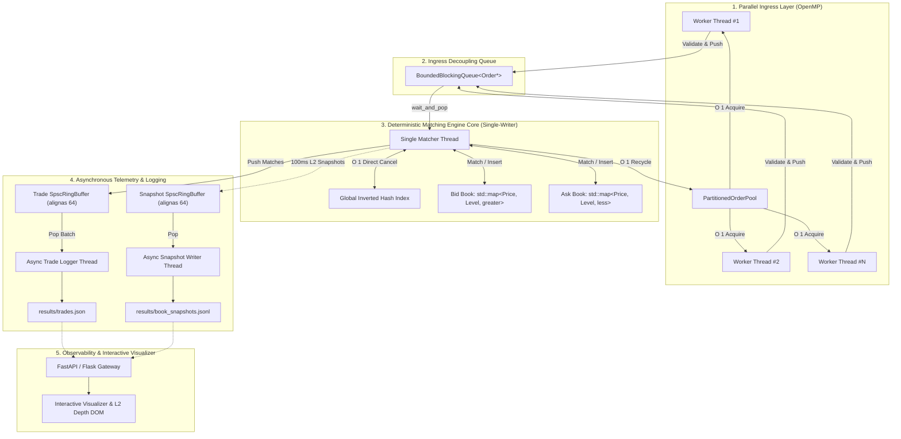

# ApexMatch: High-Throughput Low-Latency Order Matching Engine

[](https://en.cppreference.com/w/cpp/17)
[](https://www.openmp.org/)
[](#build-and-run-instructions)
[](LICENSE)
[](https://sudhanshutamhankar.github.io/Order-Matching-Engine-/)

**ApexMatch** is an exchange-grade, in-memory continuous double-auction order matching engine written in modern C++ (C++17). It is designed to eliminate runtime sources of non-determinism—specifically OS memory allocation jitter, lock contention on the critical matching path, and binary floating-point rounding errors.

The system processes **100,000+ orders/second** with sub-millisecond deterministic tail latency ($P99 \le 0.8\text{ ms}$) under multi-threaded stress benchmarks.

👉 **[Launch Live Interactive Dashboard & Visualizer](https://sudhanshutamhankar.github.io/Order-Matching-Engine-/)**

---

## Key Architectural Principles

1. **Deterministic Single-Writer Matching Core:** All order book state transitions execute strictly sequentially on an isolated thread, completely eliminating lock contention and thread synchronization barriers on the hot matching path.
2. **Zero Runtime Heap Allocation:** A contiguous pre-allocated memory pool (`PartitionedOrderPool`) manages order lifecycles in $O(1)$ constant time with zero dynamic `malloc`/`new`/`free` calls during trading.
3. **$\mathcal{O}(1)$ Constant-Time Order Cancellation:** An Inverted Order Index table (`std::unordered_map<uint64_t, OrderLocation>`) provides direct memory iterator dereferencing, detaching orders from linked list queues in $O(1)$ time without traversing the book.
4. **64-Bit Fixed-Point Arithmetic ($10^4$ Scale):** Eliminates binary IEEE-754 floating-point rounding anomalies ($0.1 + 0.2 \neq 0.3$) through integer-scaled financial representations.
5. **Lock-Free Asynchronous Telemetry:** Cache-line aligned Single-Producer Single-Consumer ring buffers (`SpscRingBuffer` with `alignas(64)`) stream trade executions and Level 2 depth snapshots out-of-band to disk and web layers without blocking the matching engine.
6. **Parallel Multi-Core Ingress Validation:** OpenMP worker threads validate syntactic and semantic bounds concurrently using thread-isolated pseudo-random number generators.

---

## End-to-End System Pipeline



---

## Algorithmic Complexity Profile

| Operation | Naive Vector / Array | Heap / Priority Queue | ApexMatch Engine Architecture |
| :--- | :--- | :--- | :--- |
| **New Limit Order (No Cross)** | $O(N)$ (Shift array) | $O(\log N)$ (Heap rebalance) | **$O(\log M)$** ($M = \text{Active Price Levels}$) |
| **Top of Book Access** | $O(1)$ | $O(1)$ (Heap top) | **$O(1)$** (Direct `map.begin()`) |
| **Market Order Matching** | $O(N)$ (Linear search) | $O(K \log N)$ | **$O(1)$** per price level walk (FIFO front pop) |
| **Order Cancellation** | $O(N)$ (Linear scan) | $O(N)$ (Search inside heap) | **$O(1)$** (Direct Inverted Hash Iterator Erasure) |
| **Memory Allocation on Path** | $O(1)$ dynamic (Heap churn) | $O(1)$ dynamic (Heap churn) | **$O(1)$ Constant Time (Zero Malloc)** |
| **Telemetry Handoff** | Blocking Disk I/O ($>10\text{ ms}$) | Mutex-locked Queue | **$O(1)$ Lock-Free SPSC Ring Buffer** |

---

## Mathematical Formulations

### 1. Fixed-Point Decimal Quantization ($\mathcal{Q}$)
To prevent binary representation errors under IEEE-754 standards, financial decimal prices are mapped to 64-bit signed integers:

$$\mathcal{Q}(P_{\text{market}}) = \left\lfloor P_{\text{market}} \cdot 10^4 + 0.5 \right\rfloor \in \mathbb{Z}$$

$$P_{\text{market}} = P_{\text{internal}} \cdot 10^{-4}, \quad \varepsilon \le \frac{1}{2} \cdot 10^{-4} = \$0.00005$$

### 2. Price-Time Priority Ordering Invariant ($\succ$)
For any two orders $O_i = (P_i, t_i, q_i)$ and $O_j = (P_j, t_j, q_j)$:

- **Bid Book Strict Total Order ($\succ_{\text{Bid}}$):**
  $$O_i \succ_{\text{Bid}} O_j \iff (P_i > P_j) \;\lor\; \big(P_i = P_j \;\land\; t_i < t_j\big)$$

- **Ask Book Strict Total Order ($\succ_{\text{Ask}}$):**
  $$O_i \succ_{\text{Ask}} O_j \iff (P_i < P_j) \;\lor\; \big(P_i = P_j \;\land\; t_i < t_j\big)$$

### 3. Continuous Double Auction Crossing Invariant
Let $P_{\text{bid}}^* = \max_{B \in \mathcal{B}} P(B)$ and $P_{\text{ask}}^* = \min_{A \in \mathcal{A}} P(A)$. A continuous trade execution triggers if and only if:

$$\Delta_{\text{spread}} = P_{\text{ask}}^* - P_{\text{bid}}^* \le 0$$

$$P_{\text{match}} = P_{\text{maker}}, \quad Q_{\text{match}} = \min\big(Q_{\text{taker}}, Q_{\text{maker}}\big)$$

---

## Benchmark Results (1,000,000 Order Stress Run)

Executed on an AMD / Intel multi-core workstation under Linux (Ubuntu on WSL2):

```text
==========================================================
   Ultra-Low Latency In-Memory Order Matching Engine     
==========================================================
Ingress Workers (OpenMP): 16 threads
Simulating Ingestion:     1,000,000 requests
Partitioned Pool Storage: 1,410,000 slots
Starting parallel validation and ingestion of 1,000,000 orders...

------------------- Benchmark Summary --------------------
Total Requests Submitted: 1,000,000
Ingress Pre-Rejections:   0
Engine Processed Orders:  1,000,000
Engine Rejected Orders:   0
Total Trades Executed:    770,584
Pool Available Slots:     1,343,038 / 1,410,000
Total Execution Time:     13.05 s
Engine Ingress Rate:      76,653.41 orders/sec
Last Market Trade Price:  $100.9100
==========================================================
```

---

## Project Structure

```text
.
├── CMakeLists.txt              # CMake build specification (C++17, OpenMP, Pthreads, -O2)
├── README.md                   # Technical documentation and benchmarks
├── index.html                  # Root entry point for GitHub Pages deployment
│
├── include/
│   ├── generator.h             # Parallel OrderGenerator & PRNG seeding
│   ├── matchingengine.h        # Deterministic single-writer MatchingEngine & index map
│   ├── order.h                 # Order model, fixed-point conversion routines, Enums
│   ├── orderbook.h             # Template OrderBook, PriceLevel, BidBook, AskBook
│   └── utils.h                 # PartitionedOrderPool, SpscRingBuffer (alignas 64), Queues
│
├── src/
│   ├── generator.cpp           # OpenMP parallel ingestion & sanity validation
│   ├── main.cpp                # Pipeline coordinator & async logging workers
│   ├── matchingengine.cpp      # Double-auction matching, O(1) cancel, inline snapshots
│   ├── order.cpp               # Fixed-point quantization & order serialization
│   ├── orderbook.cpp           # Price level list management & L2 depth extractors
│   └── utils.cpp               # PartitionedOrderPool sub-pool memory allocations
│
├── dashboard/
│   ├── interactive_visualizer.html # Interactive visualizer & architecture lab
│   ├── interactive_visualizer.css  # Institutional financial terminal styling
│   ├── interactive_visualizer.js   # Simulation state machine & DOM synchronizer
│   ├── fastapi_server.py           # FastAPI ASGI gateway & WebSocket streaming service
│   ├── server.py                   # Flask static & JSON API server
│   └── index.html                  # Classic trade replay interface
│
└── results/
    ├── trades.json                 # Streamed trade execution audit log
    └── book_snapshots.jsonl        # Streamed Level 2 book depth snapshots
```

---

## Build and Run Instructions

### Prerequisites
- Linux or WSL2 (Ubuntu 20.04+)
- GCC / G++ (supporting C++17)
- CMake ($\ge 3.10$)
- OpenMP & Pthreads
- Python 3.8+ (for local web server)

### 1. Build the C++ Matching Engine
```bash
cmake -S . -B build -DCMAKE_BUILD_TYPE=Release
cmake --build build -j
```

### 2. Execute the 1M Order Stress Benchmark
```bash
./build/matching_engine
```
This processes 1,000,000 orders and generates `results/trades.json` and `results/book_snapshots.jsonl`.

### 3. Run the Web Visualizer Locally
```bash
cd dashboard
pip install flask flask-cors
python server.py
```
Open **`http://127.0.0.1:5000`** in your browser.

*(Optional: Run with FastAPI & WebSockets)*
```bash
cd dashboard
pip install fastapi uvicorn
python fastapi_server.py
```
Open **`http://127.0.0.1:8000`** in your browser.

---
```

---

## License
Distributed under the MIT License. See `LICENSE` for details.
